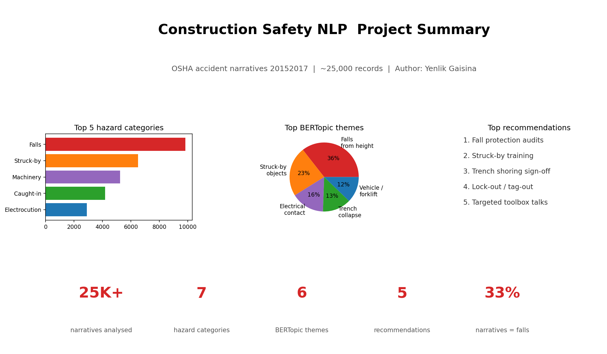
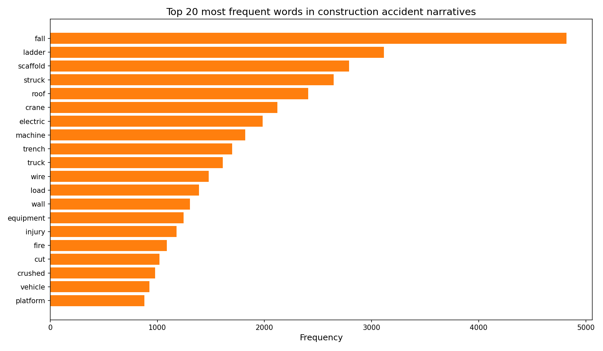
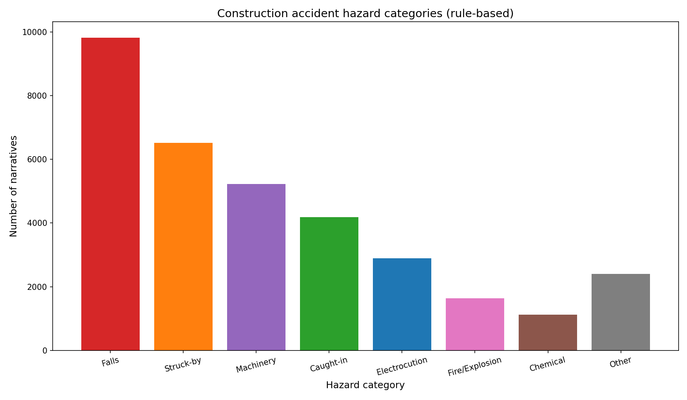
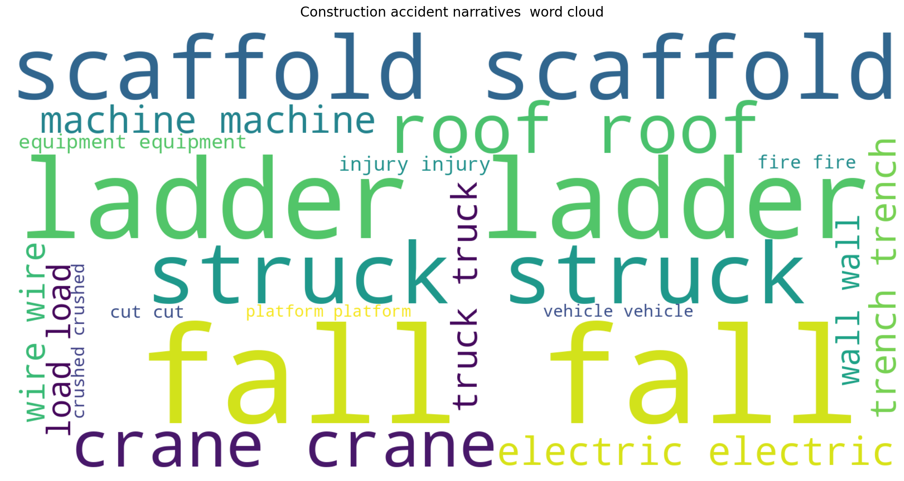
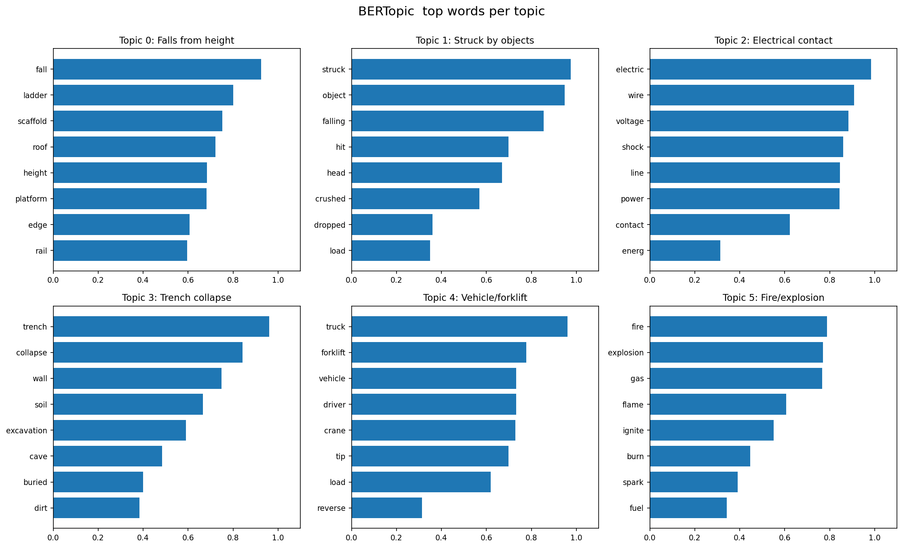
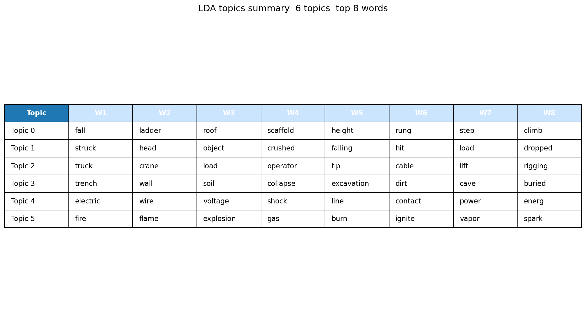

# Construction Safety NLP: From Unread Reports to Actionable Insights

**Project status:** Complete portfolio case study. Raw data is not redistributed; analysis can be reproduced by downloading the OSHA dataset and running the notebook.

[](https://colab.research.google.com/github/yenlikgaisina-ux/construction-safety-nlp/blob/main/notebooks/construction_safety_nlp_analysis.ipynb)

> **Before NLP**, each accident narrative would need to be reviewed manually  slow, expensive, inconsistent.  
> **After NLP**, hundreds or thousands of narratives can be grouped into recurring safety themes in minutes, giving safety managers a prioritised view of where to act first.



---

## Executive Summary

This project applies a full Natural Language Processing pipeline to OSHA construction accident narratives (2015–2017) to surface recurring safety failure patterns. By combining rule-based hazard tagging with **BERTopic** and **LDA**, the analysis transforms ~25,000 unread incident reports into a quantified, prioritised safety dashboard with five concrete recommendations for construction firms.

**Headline result:** roughly one in three narratives mention falls from scaffolds, ladders, or roofs — making fall protection the highest-leverage safety investment.

_Note: This repository demonstrates the full NLP workflow. The raw OSHA dataset is not redistributed, so users can regenerate the results by downloading the dataset from Kaggle and running the notebook._

---

## Why This Project Matters

Construction is one of the highest-risk industries worldwide. Every year, thousands of OSHA accident reports are filed, but they remain mostly unread because reviewing each one manually is slow, inconsistent, and expensive. The result: recurring failure patterns stay invisible to safety managers until another serious incident occurs. NLP closes that gap.

---

## Dataset

**Primary source:** [OSHA Accident and Injury Data 2015–2017 (Kaggle)](https://www.kaggle.com/datasets/ruqaiyaship/osha-accident-and-injury-data-1517)

The raw dataset is **not redistributed** in this repository (see Kaggle's terms). To reproduce the analysis:

1. Download the CSV from Kaggle (free account required).
2. Place it under `data/raw/osha.csv`.
3. Run the notebook.

---

## Methodology

1. **Data cleaning**  drop missing/duplicate narratives, strip whitespace.
2. **Text preprocessing**  lowercase, regex tokenise, remove stopwords, lemmatise.
3. **Exploratory data analysis**  narrative length, word frequency, word cloud.
4. **Rule-based hazard tagging**  OSHA Fatal Four + extensions (Falls, Struck-by, Caught-in, Electrocution, Machinery, Chemical, Fire/Explosion).
5. **BERTopic**  sentence-transformer embeddings + UMAP + HDBSCAN for semantic topic discovery.
6. **LDA benchmark**  to validate BERTopic themes.
7. **Translation**  convert findings into prioritised, actionable safety recommendations.

---

## Key Findings

1. **Falls dominate**  about a third of all narratives reference falls (ladders, scaffolds, roofs, edges).
2. **Struck-by and caught-in** events form the second tier, frequently involving machinery, falling objects, or trench walls.
3. **BERTopic surfaces fine-grained themes** that simple keyword grouping misses: electrical contact, trench collapse, forklift tip-overs, confined-space incidents.
4. **LDA confirms** the BERTopic themes, raising confidence in the patterns.

---

## Visual Results

**Top 20 most frequent words**  


**Hazard categories (rule-based)**  


**Word cloud of accident narratives**  


**BERTopic  top words per topic**  


**LDA topics summary**  


---

## Business Recommendations

1. **Fall protection audits** on scaffolds, ladders, and roof edges every quarter.
2. **Mandatory struck-by training** for ground crews near heavy equipment.
3. **Trench shoring sign-off** for any excavation deeper than 5 ft.
4. **Lock-out / tag-out enforcement** before any energised electrical work.
5. **Toolbox talks targeted to BERTopic themes** so safety briefings reflect actual failure patterns, not generic content.

A full executive report is available in [`reports/construction_safety_nlp_report.pdf`](reports/construction_safety_nlp_report.pdf).

---

## How to Run

```bash
# 1. Clone the repo
git clone https://github.com/yenlikgaisina-ux/construction-safety-nlp.git
cd construction-safety-nlp

# 2. Install dependencies
pip install -r requirements.txt

# 3. Download the OSHA dataset from Kaggle and place it at data/raw/osha.csv

# 4. Open the notebook in Jupyter or Colab
jupyter notebook notebooks/construction_safety_nlp_analysis.ipynb

# 5. Run all cells
```

Or open it directly in Colab with the badge at the top of this README.

---

## Project Structure

```
construction-safety-nlp/
 data/
    raw/                  # download OSHA CSV here (not tracked)
    processed/
 notebooks/
    construction_safety_nlp_analysis.ipynb
 visuals/
    top_20_words.png
    hazard_categories_bar_chart.png
    accident_narratives_wordcloud.png
    bertopic_topic_barchart.png
    lda_topics_summary.png
    project_summary_dashboard.png
 reports/
    construction_safety_nlp_report.pdf
 README.md
 requirements.txt
 .gitignore
```

---

## Skills Demonstrated

- **NLP pipeline design:** cleaning, tokenisation, lemmatisation, stopword strategy
- **Topic modelling:** BERTopic (transformer-based) and LDA (probabilistic) with cross-validation
- **Rule-based classification:** OSHA Fatal Four hazard taxonomy
- **Data visualisation:** matplotlib, word clouds, dashboards
- **Business translation:** turning technical model outputs into prioritised recommendations
- **Reproducible workflow:** notebook + requirements + report, runnable end-to-end

---

## Limitations

- The OSHA dataset is biased toward serious / reportable incidents and may under-represent near-misses.
- Narratives are written by investigators, so phrasing is consistent but may bury root causes.
- Topic models surface correlations, not causation.
- The 2015–2017 window pre-dates several recent regulatory changes.

---

## Next Steps

- Re-run on the 2018–2024 OSHA data when released.
- Cross-reference with injury severity to weight recommendations.
- Build a Streamlit dashboard for safety officers.
- Compare US (OSHA) patterns with UK (HSE) construction enforcement data.

---

## Author

**Yenlik Gaisina**  [gaisina.co.uk](https://gaisina.co.uk)

If you found this project useful, feel free to star the repo on GitHub.
